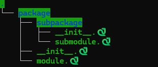

# 🐍 emojdule

Import Python modules with snake emoji extension!



## Installation

```bash
pip install emojdule
```

## Usage
Once you have installed emojdule in your venv, there is nothing else to do, you can just import your modules like usual.

You can see an example [here](./example/main.py)

```
example
├── package
│ ├── subpackage
│ │ ├── __init__.🐍
│ │ └── submodule.🐍
│ ├── __init__.🐍
│ └── module.🐍
└── main.py
```

```python
# main.py

from package.module import hello

hello()  # Hello from snake module! 🐍
```
